<!--
  ════════════════════════════════════════════════════════════════════
   ⬢  PROFILE README — OLUWADARE DANIEL  ·  github.com/Emerald-dev0
  ════════════════════════════════════════════════════════════════════
   👋 Hi future-me / hi visitor. Quick maintenance notes:

   ⚠️  SHOWING THIS ON YOUR PROFILE
   GitHub only renders a profile README from a repo named exactly the
   same as your username. This repo is still called "Oluwadaredaniel"
   (pre-rename), so: Settings → General → Danger Zone → Rename this
   repository to `Emerald-dev0`. Then search this file for
   "Oluwadaredaniel" and update the two snake-animation URLs below.

   ✏️  EDIT-ME ZONES (search this file for "EDIT_ME" / "EDIT ME")
   • Social links at the bottom (X / LinkedIn / email) are placeholders.
   • ⏱️ WakaTime card: paste your WakaTime @username (SETUP.md §4).
   • 🎧 Spotify card: paste the uid from the one-click connect (SETUP.md §5).
   • The 🐍 snake appears after `.github/workflows/snake.yml` runs once
     (Actions tab → "🐍 Snake" → Run workflow).
   • Full walkthrough for all of the above: SETUP.md

   📊  Everything else is live: the stat cards, streak, trophies,
   activity radar and typing header all pull from GitHub in real time.
  ════════════════════════════════════════════════════════════════════
-->

<picture>
  <source media="(prefers-color-scheme: dark)" srcset="assets/hero-dark.svg">
  <source media="(prefers-color-scheme: light)" srcset="assets/hero-light.svg">
  
</picture>

<p align="center">
  
</p>

<p align="center">
  
  
  
  
</p>


## 👋 About Me

<table>
<tr>
<td width="60%">

Hi — I'm **Oluwadare Daniel**, a frontend engineer who treats the browser like a canvas. I build interfaces that are fast, accessible and *feel alive*: deliberate typography, purposeful motion, pixel-honest polish.

- 🔭 **Building:** [Calder](https://github.com/Emerald-dev0/Calder) — *Avenor*, developer-first communication infrastructure, with transactional email as the first primitive
- 🤖 **Exploring:** applied AI engineering — [Blueprint](https://github.com/Emerald-dev0/Blueprint) (an AI command center), [J.O.B.S](https://github.com/Emerald-dev0/J.O.B.S) (an agent that applies to jobs for me) and Gemini-powered experiences like [AOT Verse](https://aot-verse.vercel.app)
- 🌱 **Sharpening:** design systems, motion craft with Framer Motion, and Node / Express + MongoDB backends
- 📱 **Also shipping on:** Android (Kotlin) and Flutter (Dart) when an idea refuses to stay in a browser tab
- 🤝 **Looking to collaborate on:** frontend builds, UI experiments, anything obsessed with typography
- ⚡ **Fun fact:** my GitHub handle changed names once — this README survived the archaeology 🏺

</td>
<td width="40%">

**🧭 Right now**

| | |
|---|---|
| 💻 Working on | Calder / Avenor |
| 📚 Learning | AI engineering · design systems |
| 🎯 2026 goal | Ship Avenor v1 to public beta |
| 🏗️ Latest build | LIFELINK digital-twin platform |
| 🌙 Default theme | Dark, obviously |
| 📬 Best signal | Portfolio ↓ or repo discussions |

</td>
</tr>
</table>


## 🧰 The Arsenal

<p align="center"><b>Languages</b></p>
<p align="center">
  
</p>

<p align="center"><b>Frameworks &amp; runtimes</b></p>
<p align="center">
  
</p>

<p align="center"><b>Tools &amp; platforms</b></p>
<p align="center">
  
</p>

<p align="center">
  
  
  
  
  
</p>


## 📈 The Numbers

<p align="center">
  
  
</p>

<p align="center">
  
  
</p>

<p align="center">
  
</p>

> 💡 Cards are fetched live from GitHub — if one takes a second to appear, it's waking up. Want 24/7 instant stats? [Self-host `github-readme-stats` on your own Vercel](https://github.com/anuraghazra/github-readme-stats#deploy-on-your-own-vercel-instance) and swap the URLs.


## ⏱️ Where The Hours Go

<!-- ✏️ EDIT ME: replace EDIT_ME in the URL below with your WakaTime @username,
     after (1) creating a free wakatime.com account, (2) installing the WakaTime
     plugin in your editor, (3) switching ON "Publicly display my coding
     activity" in WakaTime → Settings → Profile. Walkthrough: SETUP.md §4.
     Sanity-test by opening the image URL directly in a browser tab. -->
<p align="center">
  
</p>
<sup>⏳ Wiring in progress — plug WakaTime in once (~10 min, SETUP.md §4) and this card counts every keystroke-hour for you, forever.</sup> <!-- delete this line once connected -->


## 🎧 Now Spinning

<!-- ✏️ EDIT ME: replace EDIT_ME with the uid you get after clicking
     "Connect with Spotify" at
     https://spotify-github-profile.kittinanx.com/api/login
     Walkthrough: SETUP.md §5. No deploy, no premium, ~2 minutes. -->
<p align="center">
  
</p>
<sup>⏳ Wiring in progress — one-click Spotify connect (SETUP.md §5) turns this into the live soundtrack of the repo.</sup> <!-- delete this line once connected -->


## 🚀 Featured Builds

| Project | What it is | Built with | Links |
|---|---|---|---|
| **Calder · Avenor** | Developer-first communication infrastructure — transactional email as the first primitive | TypeScript · Node | [code](https://github.com/Emerald-dev0/Calder) · [live](https://calder-web.vercel.app) |
| **Blueprint** ⭐ | An AI engineering command center — one pane of glass for models, runs and prompts | TypeScript · AI | [code](https://github.com/Emerald-dev0/Blueprint) |
| **LIFELINK** | Emergency health identity platform on Ontomorph digital twins — when you can't speak for yourself, your data does | Next.js · MongoDB · QR | [code](https://github.com/Emerald-dev0/lifelink-emergency-twin) · [live](https://lifelink-rho.vercel.app) |
| **AOT Verse** | The Attack on Titan universe, rendered as an explorable visual world | React · Vite · Gemini | [code](https://github.com/Emerald-dev0/AOT) · [live](https://aot-verse.vercel.app) |
| **Noma-Form** | A typography-first study of how type alone can carry a whole interface | TypeScript · CSS | [code](https://github.com/Emerald-dev0/Noma-Form) · [live](https://noma.pxxl.click) |
| **J.O.B.S** | An agent designed to hunt, tailor and apply to jobs on my behalf | TypeScript · AI | [code](https://github.com/Emerald-dev0/J.O.B.S) |
| **Portfolio** | My corner of the internet — dark, animated, unapologetically emerald | Next.js · Framer Motion | [code](https://github.com/Emerald-dev0/Portfolio) · [live](https://emerald-blush.vercel.app) |

<sup>60+ more experiments, prototypes and happy accidents live in [the repos](https://github.com/Emerald-dev0?tab=repositories). Every one taught me something.</sup>

## 🗺️ The Journey

- **2024 · First commits** — Frontend Mentor challenges, QR cards, CSS fundamentals. Learning the keyboard, one `div` at a time.
- **2025 · Shipping real things** — HOOB, Synapse (edtech), Mentora, DevScoop. TypeScript quietly becomes the default language, and Vercel becomes a second home.
- **2026 · The systems era** — AI agents (`J.O.B.S`, `Blueprint`), Gemini-powered worlds (`AOT Verse`), health-tech (`LIFELINK`)… and now infrastructure itself: **Calder / Avenor**.


## 🐍 The Snake That Eats My Contributions

<!-- If you rename the repo to Emerald-dev0, update both URLs below (Oluwadaredaniel → Emerald-dev0). -->
<picture>
  <source media="(prefers-color-scheme: dark)" srcset="https://raw.githubusercontent.com/Emerald-dev0/Oluwadaredaniel/output/github-contribution-grid-snake-dark.svg">
  <source media="(prefers-color-scheme: light)" srcset="https://raw.githubusercontent.com/Emerald-dev0/Oluwadaredaniel/output/github-contribution-grid-snake.svg">
  
</picture>

<sup>Generated by <code>.github/workflows/snake.yml</code> — it re-eats my grid every 12 hours. If the image above is missing, run the workflow once from the Actions tab.</sup>


## 💬 Fuel For The Build

<p align="center">
  
</p>

## 📫 Let's Connect

<!-- ✏️ EDIT ME: replace the placeholder hrefs (#) with your real handles -->
<p align="center">
  <a href="https://emerald-blush.vercel.app"></a>
  <a href="https://github.com/Emerald-dev0"></a>
  <a href="#"></a>
  <a href="#"></a>
  <a href="mailto:you@example.com"></a>
</p>

<details>
<summary>🥚 <b>Easter egg — you scrolled this far. Respect.</b></summary>

<pre>
      ╱╲
     ╱  ╲        You found the gem.
    ╱ 💚 ╲       The handle is Emerald,
    ╲    ╱       the theme is emerald,
     ╲  ╱        and now, officially,
      ╲╱         so is your day.
</pre>

```js
console.log("if this made you smile, the star button is right up there ⭐");
```

</details>


<p align="center">
  <sub>Handmade with 💚, Markdown and exactly zero frameworks.<br>
  If this README made your profile tour better, <a href="https://github.com/Emerald-dev0/Oluwadaredaniel">star the repo</a> — it's the only currency this snake accepts.</sub>
</p>
